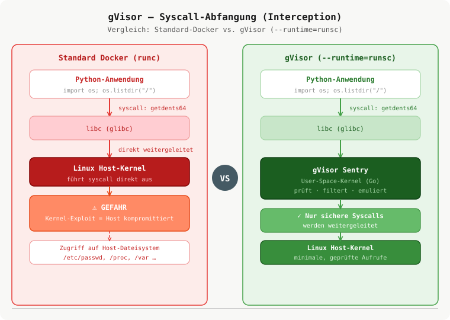

# gVisor — Sandbox-Kernel für sichere Code-Ausführung

## Parallele Verarbeitung mit gVisor




---

## Was ist gVisor?

gVisor ist ein von Google entwickelter **User-Space-Kernel**, der in Go geschrieben ist. Er fängt alle Systemaufrufe (Syscalls) eines Containers ab und emuliert sie, anstatt sie direkt an den Host-Kernel weiterzuleiten.

```
Ohne gVisor (Standard-Docker):
┌─────────────────────────┐
│  Python-Code             │
│  ↓ syscall               │
│  Linux-Kernel (Host)    │  ← Exploit hier = Host kompromittiert
└─────────────────────────┘

Mit gVisor (--runtime=runsc):
┌─────────────────────────┐
│  Python-Code             │
│  ↓ syscall               │
│  gVisor-Kernel (Go)     │  ← Exploit hier = nur Sandbox betroffen
│  ↓ gefiltert             │
│  Linux-Kernel (Host)    │  ← bleibt geschützt
└─────────────────────────┘
```

---

## Warum gVisor in diesem Projekt?

Dieses Projekt führt beliebigen Python-Code aus, den Benutzer einsenden. Ohne Isolation könnte ein bösartiger Code:

- Dateien auf dem Host lesen oder schreiben
- Netzwerkverbindungen aufbauen
- Andere Prozesse beeinflussen
- Kernel-Exploits ausnutzen

gVisor fügt eine zweite Schutzschicht hinzu, die über die Standard-Docker-Isolation hinausgeht.

---


## Wie funktioniert gVisor?

gVisor besteht aus zwei Hauptkomponenten:

### 1. `runsc` (Run Sandbox Container)
Die Container-Runtime, die anstelle von `runc` verwendet wird. Sie startet jeden Container in einer isolierten gVisor-Umgebung.

### 2. Sentry
Der eigentliche User-Space-Kernel. Er implementiert einen Großteil der Linux-Kernel-Schnittstelle in Go und verwaltet:
- Prozesse und Threads
- Speicherverwaltung
- Dateisystem-Operationen
- Netzwerk-Stack

### Syscall-Abfangung


```
Python: open("/etc/passwd")
  ↓
gVisor Sentry: prüft, filtert, emuliert
  ↓ (nur sichere, notwendige Calls)
Host-Kernel: minimale Syscalls
```

---

## Installation (Ubuntu/Debian)

```bash
# GPG-Schlüssel und Repository hinzufügen
curl -fsSL https://gvisor.dev/archive.key | sudo gpg --dearmor \
  -o /usr/share/keyrings/gvisor-archive-keyring.gpg

echo "deb [arch=$(dpkg --print-architecture) \
  signed-by=/usr/share/keyrings/gvisor-archive-keyring.gpg] \
  https://storage.googleapis.com/gvisor/releases release main" | \
  sudo tee /etc/apt/sources.list.d/gvisor.list > /dev/null

sudo apt-get update && sudo apt-get install -y runsc
```

### Docker-Integration

```bash
# gVisor als Docker-Runtime registrieren
sudo runsc install

# Docker neu starten
sudo systemctl restart docker

# Überprüfen
docker info | grep -i runtime
# → Runtimes: runc runsc
```

### Netzwerk-Konfiguration

Da gVisor keinen Zugriff auf den Root-Netzwerk-Namespace hat, muss `--network=none` als Standard gesetzt werden:

```json
// /etc/docker/daemon.json
{
  "runtimes": {
    "runsc": {
      "path": "/usr/bin/runsc",
      "runtimeArgs": ["--network=none"]
    }
  }
}
```

---

## Verwendung in diesem Projekt

### Docker-Flags bei jeder Code-Ausführung

```typescript
// src/tools/code_exec.ts
const args = [
  "run", "--rm",
  "--runtime=runsc",              // ← gVisor aktivieren
  "--network=none",               // ← kein Netzwerkzugriff
  "--read-only",                  // ← schreibgeschütztes Dateisystem
  "--cap-drop=ALL",               // ← keine Linux-Capabilities
  "--security-opt=no-new-privileges",
  "--memory=256m",                // ← RAM-Limit
  "--cpus=1.0",                   // ← CPU-Limit
  "--tmpfs=/tmp:size=64m",        // ← RAM-Disk (einziger Schreibbereich)
  "--pids-limit=64",              // ← Schutz vor Fork-Bombs
];
```

### Sicherheitsschichten im Vergleich

| Schutzmaßnahme | Standard-Docker | Mit gVisor |
|---|---|---|
| Prozess-Isolation | ✓ Namespaces | ✓ + eigener Kernel |
| Kernel-Exploit-Schutz | ✗ | ✓ Syscalls gefiltert |
| Dateisystem | ✓ read-only | ✓ + eigenes VFS |
| Netzwerk | ✓ `--network=none` | ✓ + eigener Stack |
| `/proc` sichtbar | Host-Prozesse sichtbar | Nur Container-Prozesse |

---

## Einschränkungen

- **Langsamerer Start**: gVisor braucht ~100–200 ms mehr zum Starten als runc
- **Nicht alle Syscalls**: Seltene oder neue Linux-Syscalls werden möglicherweise nicht unterstützt
- **Kein Netzwerk im Root-Namespace**: Erfordert `--network=none` Konfiguration (bereits gesetzt)
- **Kein KVM**: Auf manchen Cloud-VMs ohne Nested Virtualization langsamer

---

## Überprüfung

```bash
# Version prüfen
runsc --version

# Test: läuft der Container wirklich mit gVisor?
docker run --rm --runtime=runsc --network=none \
  code-exec-sandbox:latest python -c \
  "import platform; print(platform.uname())"
# → uname_result(..., sysname='Linux') — gVisor emuliert Linux-Kernel

# Docker-Runtimes anzeigen
docker info | grep Runtimes
# → Runtimes: runc runsc
```

---

## Weiterführende Links

- [gVisor offizielle Dokumentation](https://gvisor.dev/docs/)
- [gVisor GitHub](https://github.com/google/gvisor)
- [Docker + gVisor Quickstart](https://gvisor.dev/docs/user_guide/docker/)
